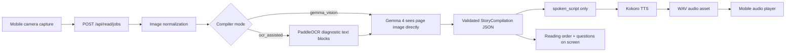

# OpenRead Technical Design Writeup

## Project Summary

OpenRead is a mobile-first read-aloud assistant for children's picture books. The core use case is simple: a caregiver takes a photo of a picture-book page, and OpenRead turns that page into a layout-aware read-aloud experience. It reads visible text in natural story order, briefly narrates meaningful illustrations, keeps caregiver prompts on-screen only, and produces speech audio through Kokoro TTS.

The technical bet behind OpenRead is that picture-book reading is not an OCR problem alone. Picture books use playful layouts, speech bubbles, curved text, small captions, full-page illustrations, and narrative clues that live in the artwork. A top-to-bottom text extractor can recognize words and still miss the story. OpenRead therefore uses Gemma 4 as a story compiler: a multimodal reasoning layer that looks at the page image, reconciles reading order, separates spoken content from caregiver guidance, and returns a validated structured object before audio synthesis.

For the Kaggle Gemma 4 Good Hackathon, OpenRead positions Gemma 4 as the bridge between visual literacy and language access. The product is designed for fragile everyday reading moments: a parent with a sore throat, a grandparent with tired eyes, a caregiver reading in a second language, or a family member holding a book in a language they cannot comfortably read aloud.

## User Problem

Natural language grows through repeated small moments. In many homes, those moments are interrupted by practical barriers:

- Voice: the adult wants to read, but cannot comfortably speak.
- Vision: the adult is present, but small print is hard to see.
- Language: the adult can support the child, but the book is in an unfamiliar language or has unfamiliar words.
- Layout: the page contains a mix of printed text, speech bubbles, captions, and illustration meaning.

OpenRead does not try to replace the caregiver. It keeps the caregiver in the moment by handling the mechanical burden of reading order and speech production.

## System Architecture

OpenRead uses a small, inspectable web architecture:

- Frontend: Vue + Vite mobile web app.
- Backend: FastAPI service.
- Vision/story compiler: Gemma 4 through the Google GenAI SDK.
- Diagnostic OCR: PaddleOCR, retained for `/api/ocr` and `ocr_assisted` comparison mode.
- Speech synthesis: Kokoro TTS, served as WAV audio.
- Job orchestration: in-memory FastAPI job manager for hackathon demo simplicity.
- Media serving: generated WAV assets stored under the backend media directory and served through `/media/audio/{request_id}`.

High-level flow:



The live default path is `gemma_vision`. `ocr_assisted` remains available for comparison, fallback, and hackathon evaluation because it makes the product's core thesis testable: a layout-aware visual story compiler should outperform OCR-only parsing on complex picture-book pages.

## API Surface

The backend keeps a clear split between diagnostics and the product read flow:

- `POST /api/ocr`: diagnostic PaddleOCR endpoint. It returns raw text blocks, confidence, boxes, and detected scripts. It is intentionally not the main product path.
- `POST /api/read`: synchronous read endpoint for direct image or text requests. Image input is compiled through Gemma before TTS; text input goes directly to TTS.
- `POST /api/read/jobs`: mobile app path. It accepts `image` or `text`, plus optional `compiler_mode=gemma_vision|ocr_assisted`, creates a background job, and returns a `request_id`.
- `GET /api/read/jobs/{request_id}`: polling endpoint exposing job status, stage, generated text, audio URL, paragraph progress, and structured story payload.
- `GET /media/audio/{request_id}`: serves cached WAV audio.

Job stages are:

- `queued`
- `story_compile`
- `ocr`
- `tts`
- `completed`
- `failed`

This staging matters for mobile UX. The app can show "understanding page" while Gemma is compiling the page, then "building audio" while Kokoro synthesizes the final script.

## Gemma 4 Implementation

OpenRead's Gemma integration lives in `backend/app/services/story_compiler.py`.

The active service is `GemmaStoryCompilerService`. It receives a normalized PIL image, compiler mode, language hint, and optional OCR page. It then:

1. Converts the page image to JPEG bytes.
2. Builds a children's picture-book reader prompt.
3. Calls the Google GenAI SDK with image bytes plus prompt.
4. Requests JSON output matching the Pydantic `StoryCompilation` schema.
5. Validates the returned JSON with Pydantic.
6. Retries once with the validation error if the model response fails schema or business validation.
7. Fails cleanly if `spoken_script` is empty or no story beats are returned.

The implementation uses the current GenAI structured-output shape:

```python
response = client.models.generate_content(
    model=self._model,
    contents=[
        types.Part.from_bytes(data=image_bytes, mime_type="image/jpeg"),
        prompt,
    ],
    config=types.GenerateContentConfig(
        response_mime_type="application/json",
        response_json_schema=StoryCompilation.model_json_schema(),
    ),
)
```

The default model is configured through:

```env
GEMMA_MODEL=gemma-4-31b-it
WORD_EXPLORER_MODEL=gemma-4-26b-a4b-it
WORD_EXPLORER_CROP_FRACTION=0.62
STORY_COMPILER_MODE=gemma_vision
STORY_COMPILER_TIMEOUT_SECONDS=90
```

The project uses `gemma-4-31b-it` because the task is not just captioning or OCR. The model must reason over mixed visual and textual evidence, infer story order, decide when illustration narration is useful, and keep adult-facing prompts out of spoken audio.

Word Explorer has a narrower, latency-sensitive path. The camera places the desired word at the center of the frame, the backend retains the centered `62%` of each image dimension, and `gemma-4-26b-a4b-it` identifies and explains the word nearest the exact crop center. This reduces irrelevant image context and uses the faster A4B model without changing the full-page story compiler.

Google describes Gemma 4 as an open model family built from Gemini 3 research, with 26B and 31B models positioned for frontier intelligence on personal computers, multimodal reasoning, and multilingual support. Those properties map directly to OpenRead's requirements: page images, child-facing language, bilingual or multilingual books, and reasoning over visual layout. Source: [Google DeepMind Gemma 4](https://deepmind.google/models/gemma/gemma-4/).

## Structured Output Contract

Gemma does not return arbitrary prose. It returns a `StoryCompilation` object:

```python
class StoryCompilation(BaseModel):
    title: str | None = None
    spoken_script: str
    beats: list[StoryBeat] = Field(default_factory=list)
    caregiver_cues: list[CaregiverCue] = Field(default_factory=list)
    diagnostics: StoryDiagnostics
```

### Story-Plan Layer

The key technical contribution is the story-plan layer. Instead of sending OCR text directly to TTS, OpenRead converts a page image into a structured reading plan first. The TTS engine receives only the final child-facing `spoken_script`, while the frontend receives the full plan for follow-along reading, reading order display, and caregiver support.

The current plan contains:

- detected page text through `source_text` on text beats, and raw PaddleOCR blocks in `ocr_assisted` mode
- corrected reading order through the ordered `beats` array
- optional picture narration through `kind=illustration` beats
- TTS-ready narration through `spoken_script`
- large-text follow-along output through the frontend's `spokenText` / `.spoken-script` view
- optional caregiver cues through `caregiver_cues`
- audit and debugging details through `diagnostics`, including compiler mode, OCR usage, layout notes, and warnings

This makes the model output controllable, auditable, and usable by multiple downstream surfaces. The backend can validate and retry the model response, Kokoro can synthesize a clean script, and the mobile UI can show readable text plus optional co-reading prompts without mixing those prompts into the spoken audio.

Speaker labels are not a dedicated schema field in the current implementation. Dialogue-like regions can be represented today with `layout_region` values such as `speech-bubble-right`, but explicit `speaker_label` support would be a straightforward future schema extension.

Each `StoryBeat` contains:

- `beat_id`
- `kind`: `text` or `illustration`
- `narration`
- `source_text`
- `layout_region`
- `confidence`

Each caregiver cue contains:

- `cue_id`
- `after_beat_id`
- `cue`
- `purpose`: `prediction`, `emotion`, `vocabulary`, or `engagement`

Diagnostics include:

- compiler mode
- layout notes
- whether OCR influenced the answer
- warnings

This contract is a technical strength of the project. It forces a clean separation between:

- what the child hears (`spoken_script`)
- what the UI displays as reading order (`beats`)
- what the caregiver can optionally ask (`caregiver_cues`)
- what the system records for debugging (`diagnostics`)

The backend tests assert that only `spoken_script` is sent to TTS. Caregiver cues are returned to the UI but never spoken. This is important because co-reading prompts should support the adult without interrupting the child's story.

Google's structured-output documentation recommends schema-backed output for predictable, type-safe extraction and application workflows; it also emphasizes validating final model output in application code. OpenRead follows that pattern with Pydantic validation plus retry. Source: [Google AI structured outputs](https://ai.google.dev/gemini-api/docs/structured-output).

## Prompt Design

The story compiler prompt frames Gemma as "OpenRead, a careful children picture-book story reader." It gives the model specific behavioral requirements:

- Analyze the page photo.
- Reconstruct natural story order for speech bubbles, sidebars, curved text, or non-top-down layouts.
- Read visible printed text faithfully.
- Correct obvious OCR or layout ordering issues.
- Do not invent missing printed text.
- Briefly narrate meaningful illustrations only when they help comprehension.
- Keep caregiver co-reading cues separate from the child-facing spoken script.
- Return only schema-matching JSON.

This prompt is deliberately narrow. The product is not trying to summarize a book, generate a new story, or provide generic image captioning. It is trying to preserve the printed page while making the layout and visual meaning accessible.

## Gemma Vision vs OCR-Assisted Mode

OpenRead implements two compiler modes:

### `gemma_vision`

The default live path. The backend sends the normalized page image directly to Gemma 4. This mode is designed for the central product insight: picture-book understanding requires visual reasoning, not just text extraction.

### `ocr_assisted`

The comparison path. The backend runs PaddleOCR first and passes OCR text, detected scripts, confidence scores, and text boxes to Gemma along with the image. The prompt instructs Gemma to use OCR only when it agrees with the page and to use the image for layout and story order.

This design is useful for the hackathon because it supports a clear benchmark story:

- OCR-only output shows what a text pipeline sees.
- Gemma vision output shows what a multimodal story compiler sees.
- OCR-assisted output shows whether explicit text blocks improve exact-word recovery without losing layout awareness.

The repository includes `backend/scripts/benchmark_story_compiler.py`, which runs both compiler modes over fixture images and writes diagnostic JSON outputs under `backend/var/diagnostics/openread/`.

## Image Input Implementation

The frontend captures the visible camera crop as a JPEG. The backend validates and normalizes the upload before compilation:

- upload size is bounded by `MAX_UPLOAD_BYTES`
- image dimensions are normalized by `IMAGE_MAX_SIDE`
- image input is converted to RGB JPEG bytes before the GenAI call

Google's image-understanding documentation shows passing inline image bytes to `generateContent` using `types.Part.from_bytes`, which is the same pattern OpenRead uses. Source: [Google AI image understanding](https://ai.google.dev/gemini-api/docs/image-understanding).

## Kokoro TTS Implementation

Kokoro is the project's speech engine. The implementation lives in `backend/app/services/tts_service.py`.

OpenRead uses:

- `kokoro==0.9.4`
- model repository `hexgrad/Kokoro-82M`
- `KPipeline` from the Kokoro package
- default English and Chinese voices
- 24 kHz WAV output
- paragraph-level synthesis with progress callbacks
- script-aware splitting for Latin and CJK text

The core TTS path:

1. Clean the text.
2. Split text by script using `split_text_by_script`.
3. Select Kokoro language code and voice for each segment.
4. Reuse cached `KPipeline` instances by language and device.
5. Generate audio chunks.
6. Convert float samples to PCM16.
7. Write mono 24 kHz WAV bytes.
8. For long text, synthesize paragraph by paragraph and concatenate WAV frames.

Kokoro is a strong fit for OpenRead because it is lightweight, local-friendly, and fast enough for an interactive demo. The Hugging Face model page identifies `hexgrad/Kokoro-82M` as a text-to-speech model with an Apache 2.0 license and a model size around 341 MB. Source: [hexgrad/Kokoro-82M on Hugging Face](https://huggingface.co/hexgrad/Kokoro-82M).

## Why Kokoro Strengthens the Overall System

Gemma solves the reasoning problem; Kokoro solves the presence problem.

OpenRead's goal is not just to extract text. It is to preserve a shared reading moment. The TTS engine must therefore be:

- responsive enough for a child waiting beside the caregiver
- local-friendly enough for a hackathon deploy without a heavy speech service
- controllable enough to ensure only child-facing text is spoken
- compatible with multilingual or mixed-script pages
- simple enough to cache, preload, and debug

Kokoro supports that design in several ways:

- Lightweight runtime: the 82M model size keeps the TTS layer practical for a demo deployment.
- Local audio generation: avoids introducing a second external inference service after Gemma.
- Deterministic artifact path: every generated read-aloud is stored as a WAV asset and served by the app.
- Script-aware routing: OpenRead can split Latin and CJK segments and use different voices/language pipelines.
- Progress reporting: paragraph synthesis lets the UI show audio-building progress instead of appearing stuck.
- Preload support: `PRELOAD_MODELS=1` warms both PaddleOCR and Kokoro at startup to reduce first-request latency.

In a hackathon pitch, this means OpenRead is not only a clever Gemma prompt. It is an end-to-end working assistive reading pipeline: multimodal reasoning in, spoken child-facing output out.

## Frontend Design

The web app is deliberately one-screen and mobile-first. It is designed for an iPhone-like capture workflow:

- one large `Open Camera` / `Take Photo` button
- no exposed model or OCR controls in the default UI
- large readable generated text
- audio player
- simple labels: `Reading Order` and `Questions to Ask`

The UI avoids technical terms such as "story beats" for ordinary caregivers. Internally, the API still uses `beats` because the backend needs a precise ordered representation. The product language translates that into "Reading Order."

The app also includes standalone HTML/CSS cinematic demo pages under `web/public/demo/` for hackathon storytelling:

- `openread-cinematic.html`
- `openread-human-moments.html`

These are CSS-timed pitch videos that can run locally through Vite without video editing software.

## Reliability and Safety Design

OpenRead includes several safeguards:

- Schema validation: Gemma output must match `StoryCompilation`.
- Business validation: empty `spoken_script` and missing beats fail.
- Retry once: invalid structured output is retried with the validation error.
- Timeout: story compilation is bounded by `STORY_COMPILER_TIMEOUT_SECONDS`.
- Separation of concerns: caregiver cues are excluded from TTS.
- Text limits: `MAX_TEXT_CHARS` prevents oversized synthesis jobs.
- Upload limits: `MAX_UPLOAD_BYTES` and image normalization constrain input.
- Concurrency gate: `MAX_ACTIVE_READS` limits CPU-heavy OCR/TTS work.
- Media cleanup: generated audio expires through TTL and disk-budget cleanup.

These choices make the system demo-ready while keeping failure modes understandable.

## Test Coverage

The repository includes backend and frontend tests that cover the hackathon-critical path:

- `/api/ocr` returns PaddleOCR-style blocks.
- `/api/read` returns text, story, and WAV metadata.
- `/api/read/jobs` returns background job progress and final audio URL.
- `ocr_assisted` invokes OCR before the compiler.
- caregiver cues are returned in job status but not sent to TTS.
- invalid structured output retries once and then fails cleanly.
- Kokoro pipeline uses explicit model repo and language warmup.
- paragraph synthesis reports progress and merges audio.
- frontend one-button flow passes `compiler_mode=gemma_vision`.
- completed reads show large text, reading order, questions, and audio.

## Technical Strengths for the Gemma 4 Good Pitch

### 1. Gemma is used as a reasoning layer, not a wrapper around OCR

The project directly addresses a class of pages where OCR is insufficient: picture books. Gemma is asked to understand page layout, visual meaning, and reading order.

### 2. The story-plan layer makes the model operational

The model output is not free-form text. It is a validated reading plan with detected text, corrected order, optional illustration narration, TTS-ready script, caregiver prompts, and diagnostics. That makes the app testable, debuggable, auditable, and directly usable by both the frontend and Kokoro.

### 3. The app preserves adult-child interaction

OpenRead keeps caregiver cues separate and on-screen. The audio remains child-facing, while the adult stays in the loop.

### 4. The system is built for accessibility moments

Voice, vision, and language barriers are not edge cases. They are the product's core design target.

### 5. Kokoro turns model output into an immediate experience

The TTS layer makes the Gemma result tangible. A child does not receive JSON; they hear a story.

### 6. OCR remains available for evaluation

By retaining PaddleOCR and adding `ocr_assisted`, the project can compare modes and show why multimodal reasoning matters.

### 7. Hackathon scope is pragmatic

Jobs are in memory, images are not durably stored, and generated audio is TTL-managed. This keeps the demo lightweight while leaving a clear path to a durable queue/database later.

## Current Limitations

The hackathon version intentionally keeps some infrastructure simple:

- Jobs are stored in memory, so they are not durable across process restarts.
- Uploaded page photos are processed in memory and not retained.
- The app currently uses polling rather than server-sent events or websockets.
- Kokoro synthesis is CPU-friendly but can still be slow for long scripts on small hosts.
- Real production use would need privacy review, child-safety review, account/session design, and more robust queueing.

These are acceptable for the hackathon because the technical goal is to prove the multimodal reading loop end to end.

## Pitch Narrative

OpenRead is built for the fragile moment when a child is ready to hear a story, but voice, vision, language, or confidence gets in the way.

Gemma 4 makes the page understandable. Kokoro makes it speak. The mobile interface keeps the caregiver present. The result is not a generic OCR reader; it is a layout-aware, picture-aware, child-facing read-aloud companion for real families.

## Source Links

- [Google DeepMind Gemma 4](https://deepmind.google/models/gemma/gemma-4/)
- [Google AI image understanding](https://ai.google.dev/gemini-api/docs/image-understanding)
- [Google AI structured outputs](https://ai.google.dev/gemini-api/docs/structured-output)
- [hexgrad/Kokoro-82M on Hugging Face](https://huggingface.co/hexgrad/Kokoro-82M)
